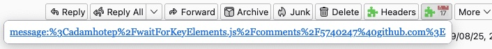
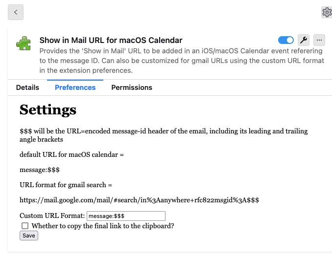

# Thunderbird add Show in Mail URL to iOS/macOS Calendar

https://addons.thunderbird.net/thunderbird/addon/message_id_url/

The "show in mail" link in the iOS/ macOS calendar is a reference to the message ID.

This extension gives the URL which can be added to an existing calendar event's URL field.

On iOS clicking the link will open the Mail app and show the message in question.

```
message:%3CABCDEF-xxxxxxxx.1@smtp-inbound1.duck.com%3E
```

The URL format can also be customized in the addon settings to create a link to Gmail or other services.

```
https://mail.google.com/mail/#search/in%3Aanywhere+rfc822msgid%3A%3Cabcde%40def.com%3E
```

To copy the URL to the clipboard, check the "Copy to clipboard" checkbox in the addon settings.




https://stackoverflow.com/questions/16827485/using-gmail-message-source-generate-direct-link/19247147#19247147
